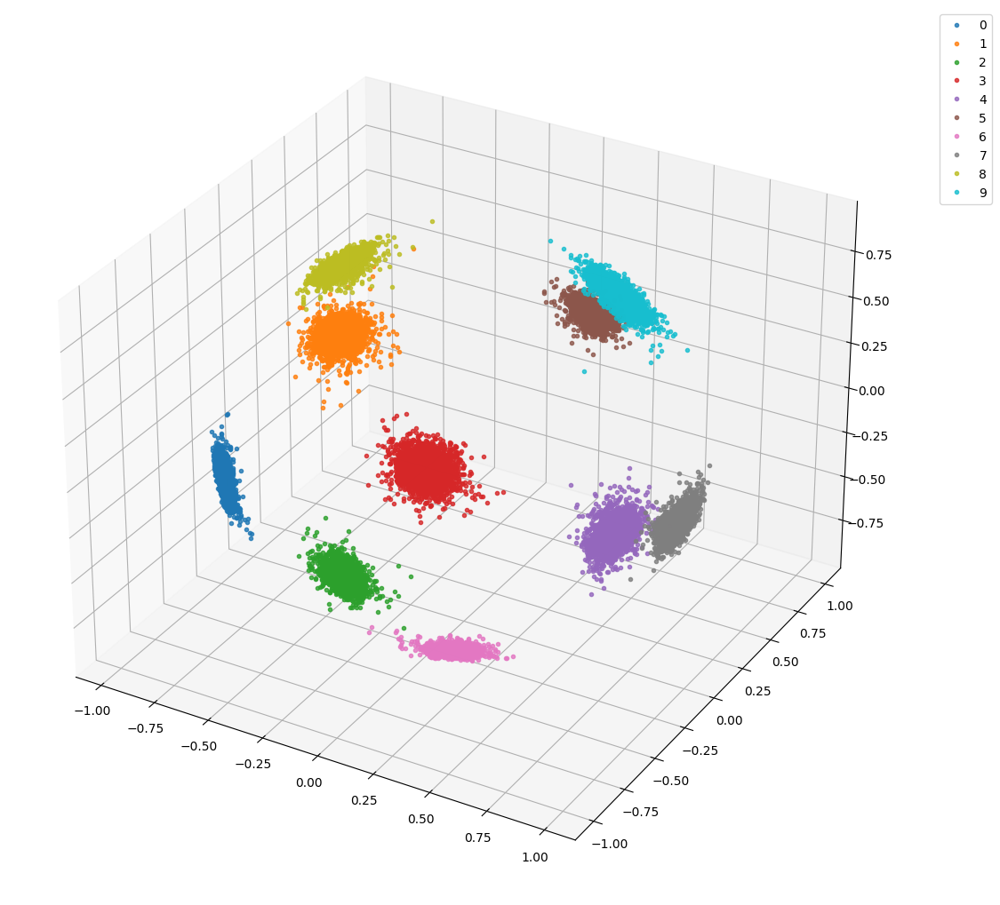
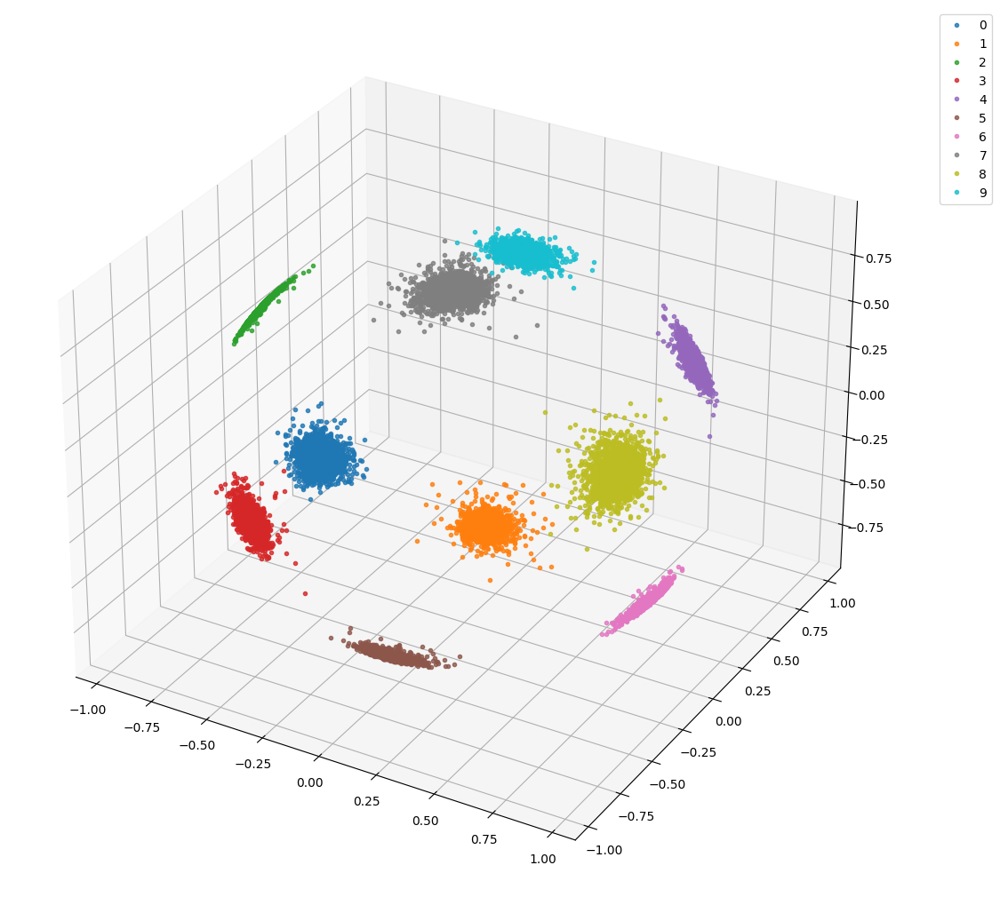
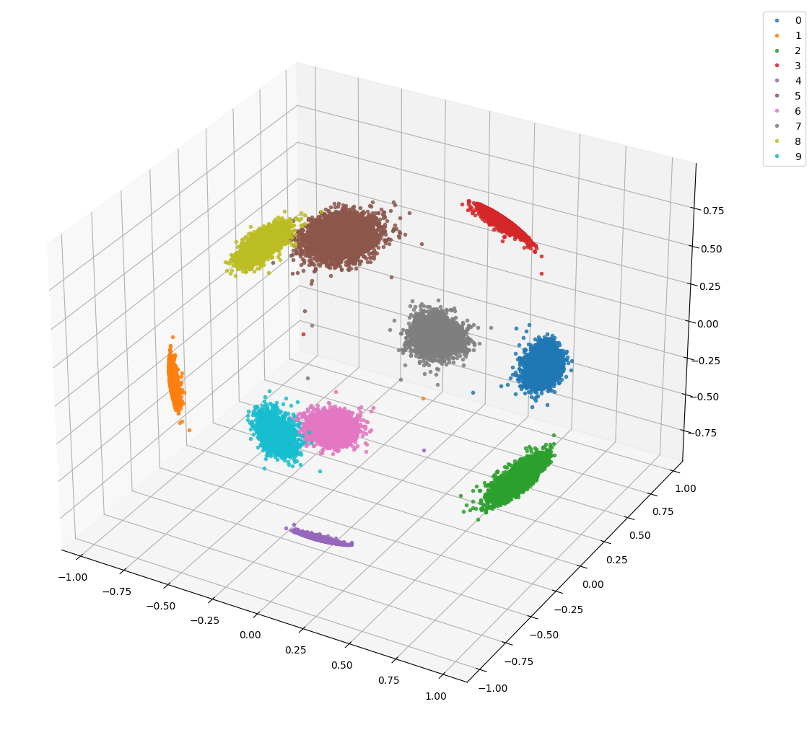

# ArcFace
Paper: [ArcFace: Additive Angular Margin Loss for Deep Face Recognition](https://arxiv.org/pdf/1801.07698.pdf)  
Framework: Pytorch

## Toy Example
Dataset: MNIST  
Network: ResNet18

### Experiments

**s=10, m=0.25, epochs=50**

**s=10, m=0.3, epochs=34**

**s=30, m=0.5, epochs=50**

