# Center Loss
Pytorch Center Loss implementation is based on [pytorch-center-loss](https://github.com/KaiyangZhou/pytorch-center-loss).

## A Toy Example
Dataset: MNIST  
Network: Modified LeNet  
Batch size: 128  
Epochs: 50  
Learning rate: 1e-2  
Optimizer: SGD  

### Cross-Entropy Loss
*Epoch 1, 5, 10, 20, 50*

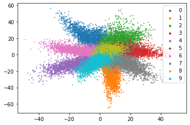
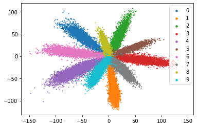
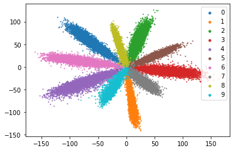
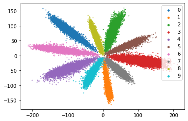
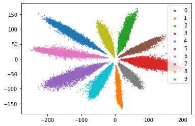

### Cross-Entropy Loss and Center Loss
*Epoch 1, 5, 10, 20, 50*  
**Lambda = 1**

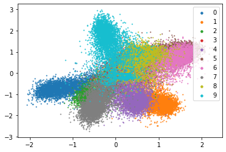
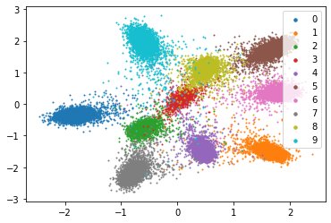
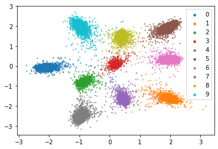
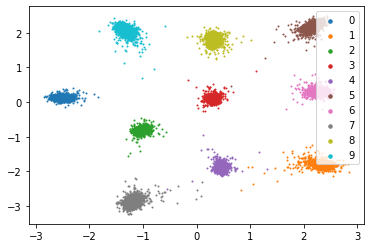
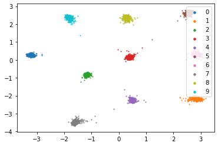

**Lambda = 0.1**

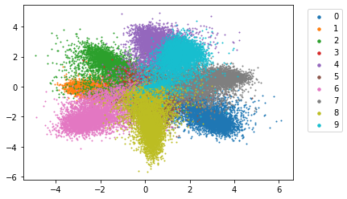
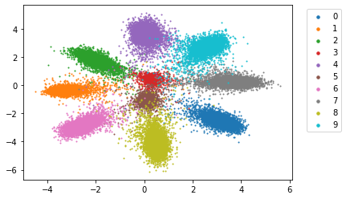
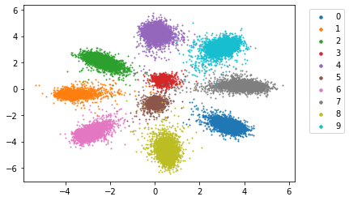
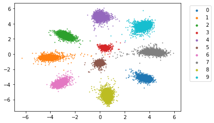
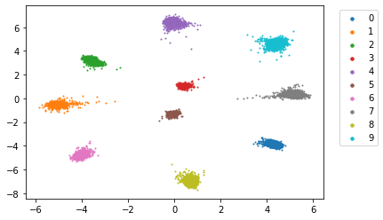

**Lambda = 0.01**

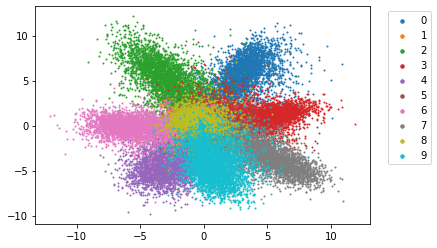
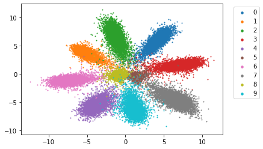
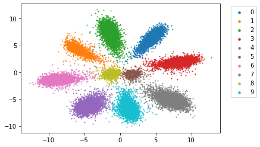
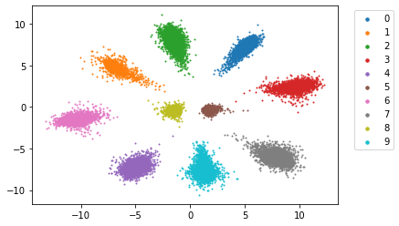
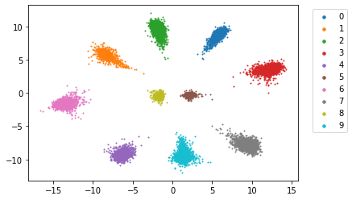

**Lambda = 0.001**

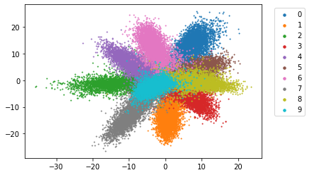
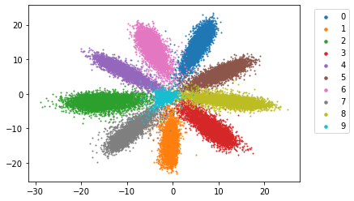
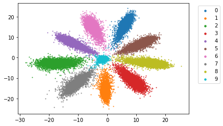
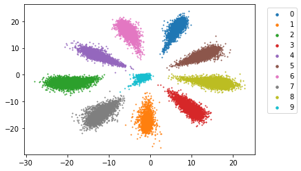
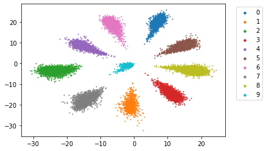
